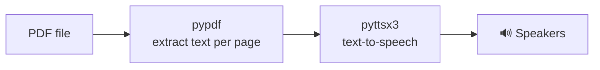

<div align="center">

# 🎧 PDF to Audio

**Turn any PDF into an audiobook. Text is extracted page by page and read aloud offline.**


</div>

---

## ✨ Features

- 📄 Extracts text from **every page** of a PDF with pypdf
- 🔊 Reads it aloud with **pyttsx3**, which works **offline** with no API keys
- 💾 Can **save the audio to a WAV file** instead of playing it
- 🎚️ Adjustable **speed**, **voice** and **start page**
- 🖥️ Prints each page's text as it reads

---

## 🚀 Getting Started

```bash
git clone https://github.com/gmgowrish/pdf_To_audio.git
cd pdf_To_audio

pip install -r requirements.txt
```

> **Linux:** install eSpeak NG first: `sudo apt install espeak-ng` (Debian/Ubuntu) or `sudo dnf install espeak-ng` (Fedora).

Try it with the included sample:

```bash
python main.py
```

Read your own PDF:

```bash
python main.py my-book.pdf
```

---

## ⚙️ Options

| Option | Example | What it does |
|---|---|---|
| `pdf` | `python main.py notes.pdf` | PDF to read (default: `sample.pdf`) |
| `--rate` | `--rate 150` | Speaking speed in words per minute (default: 200) |
| `--voice` | `--voice 2` | Voice to use (default: your system voice) |
| `--list-voices` | `--list-voices` | Show the available voices and their numbers |
| `--start` | `--start 10` | Start reading from page 10 |
| `--save` | `--save book.wav` | Save the audio to a file instead of playing it |

```bash
# Save chapter audio from page 5 onwards, read a bit slower
python main.py my-book.pdf --start 5 --rate 160 --save my-book.wav
```

---

## 🛠️ How it works



## 🔮 Ideas

- Export to MP3
- Pick the PDF with a file dialog
- A simple GUI with play / pause

---

<div align="center">

Made by **[G M Gowrish](https://github.com/gmgowrish)** · ⭐ Star the repo if you find it useful!

</div>
