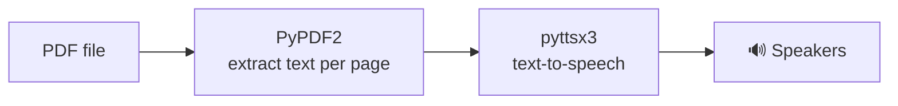

<div align="center">

# 🎧 PDF to Audio

**Turn any PDF into an audiobook. Text is extracted page by page and read aloud offline.**


</div>

---

## ✨ Features

- 📄 Extracts text from **every page** of a PDF with PyPDF2
- 🔊 Reads it aloud with **pyttsx3**, which works **offline** with no API keys
- 🎚️ Adjustable **speaking rate** and **voice**
- 🖥️ Prints each page number and its text as it reads

---

## 🚀 Getting Started

```bash
git clone https://github.com/gmgowrish/pdf_To_audio.git
cd pdf_To_audio

pip install PyPDF2 pyttsx3
```

> **Linux:** pyttsx3 uses eSpeak, so install it first: `sudo apt install espeak` (Debian/Ubuntu) or `sudo dnf install espeak` (Fedora).

### Use your own PDF

Put your PDF in the folder and change the file name in `main.py`:

```python
with open('your-book.pdf', 'rb') as book:
```

Then run:

```bash
python main.py
```

---

## ⚙️ Customize

```python
audio_reader.setProperty('rate', 200)                         # words per minute
audio_reader.setProperty('voice', audio_reader.voices[0].id)  # 0 / 1 = different voices
```

The available voices depend on your operating system.

---

## 🛠️ How it works



## 🔮 Ideas

- Save the audio to an MP3 instead of playing it
- Pick the PDF with a file dialog
- Start from a chosen page

---

<div align="center">

Made by **[G M Gowrish](https://github.com/gmgowrish)** · ⭐ Star the repo if you find it useful!

</div>
